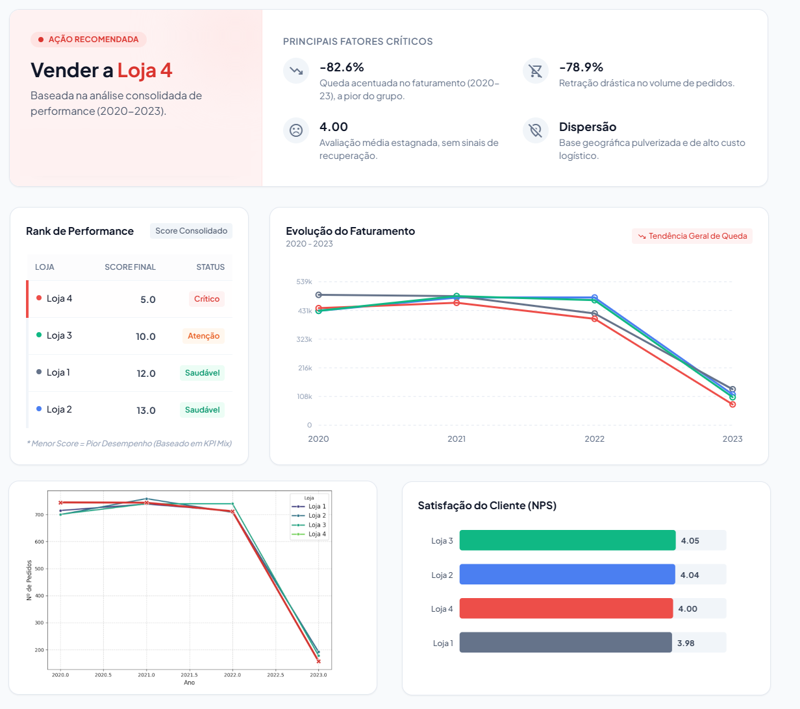

<h1 align="center">
    
</h1>

 

# 🚀 Tecnologias

Esse projeto foi desenvolvido com as seguintes tecnologias:

- [Colab](https://colab.research.google.com/)
- [Python](https://www.python.org/)
- Manipulação de Dados: Pandas, NumPy
- Visualização de Dados: Matplotlib, Seaborn, Folium
- Interatividade: IPywidgets

# 💻 Projeto

Este projeto utiliza a ciência de dados e técnicas de storytelling para responder a uma pergunta de negócio crucial: Qual das quatro lojas de um empreendedor deve ser vendida para otimizar os recursos e focar no crescimento?

Através de uma análise exploratória detalhada e visualizações interativas, transformamos dados brutos em uma narrativa clara e acionável, permitindo uma decisão baseada em evidências e não em intuição.

# 🎯 Propósito da Análise
O Sr. João, proprietário de quatro lojas de varejo, enfrentava o dilema de qual unidade vender para simplificar suas operações. O objetivo principal desta análise foi utilizar a ciência de dados para identificar qual das quatro lojas apresentava o pior desempenho de forma consistente, tornando-a a candidata ideal para a venda.

Para isso, a análise foi estruturada como uma narrativa, investigando as seguintes questões-chave:

Qual loja tem a melhor saúde financeira? (Faturamento total)
Qual a tendência de crescimento de cada loja? (Análise temporal do faturamento e do volume de pedidos)
Como a satisfação do cliente varia entre as lojas? (Avaliação média)
O frete é um indicador de ineficiência ou uma característica do produto? (Análise do frete por categoria)
Existe um padrão geográfico nas vendas? (Análise de localização dos clientes)

# 🔖 Resultado

  

# 🚀 Como Executar o Notebook
Siga os passos abaixo para reproduzir a análise em seu próprio ambiente.

Pré-requisitos
Certifique-se de ter as seguintes bibliotecas Python instaladas:

pandas
matplotlib
seaborn
numpy
ipywidgets
folium

Passo 1: Ambiente (Recomendado)
A forma mais simples de executar este projeto é através do Google Colab, que já possui a maioria das bibliotecas instaladas.

Abra o Google Colab (colab.research.google.com).
Clique em Arquivo -> Abrir notebook e faça o upload do arquivo analise_vendas_lojas.ipynb.
Passo 2: Execução
Com o notebook aberto no Colab, execute as células sequencialmente, de cima para baixo.
As células de código que contêm visualizações interativas (ipywidgets e folium) exibirão os menus suspensos e os mapas diretamente abaixo do código após serem executados.
Execução Local (Opcional)
Se preferir executar localmente:

Clone este repositório.
Crie um ambiente virtual: python -m venv venv
Ative o ambiente: source venv/bin/activate (Linux/Mac) ou venv\Scripts\activate (Windows)
Instale as dependências: 
pip install pandas matplotlib seaborn numpy ipywidgets folium jupyterlab

Inicie o Jupyter Lab: jupyter lab
Abra e execute o notebook.

# 🔖 Video Explicativo
 
 

👤 Autor
Luiz Fernando Barbosa

